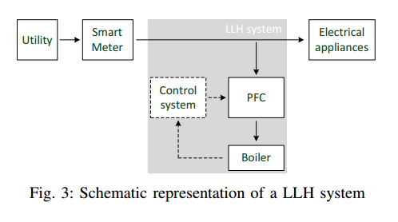

## [Load Hiding of Household's Power Demand](http://ieeexplore.ieee.org/xpls/abs_all.jsp?arnumber=7007755&tag=1)

### Summary

### Workloads
- Controllable household workload
  - Workload: controllable, have a daily powe consumption and are not user driven.
  - Example: electric water boiler
    - controlling a boiler by a given daily power consumption.
  - Example: electric vehicle charger
- Workload model
  - Daily energy consumption: the device is assigned by a daily target energy consumption, i.e., an amont of energy the device is supposed to spend during a day in order to fulfill its target function.
  - Maximum power: 
  
### Proposed Load-based Load Hiding (LLH) Mechanism
- Given the total energy consumption in a day of the boiler, use bata distribution to decide its energy consumption along the time.

### Model
- Schematic representation of BLH system

- Schemeatic representation of LLH System

### Load Disaggregation Approach
- Use Factorial Hidden Makrov Chain Model. 
- Measurement
  - event-based metrics
    - true positive, true negative, true positive rate, F-score etc.
  - non event-based metrics
    - mean error, hamming loss
  - the overall metrics
- In this work, they use acuracy matrics, ACC = (TP + TN)/n

### Load Hiding Metrics
- Measurement: mean square root error (RMSE)
  - \sqrt(\sum^n_{i=1} (d_i - e_i)^2/n)

### Comments
- I don't think RMSE is a good metrics for measuring the load hiding. For example, 10^2+10^2 < (20)^2, thus it would be better to just have some high peak of the noise distribution.
