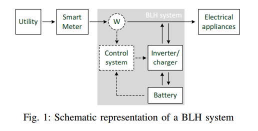

## [Load Hiding of Household's Power Demand](http://ieeexplore.ieee.org/xpls/abs_all.jsp?arnumber=7007755&tag=1)

### Summary

### Workloads
- Controllable household workload
  - Workload: controllable, have a daily powe consumption and are not user driven.
  - Example: electric water boiler
    - controlling a boiler by a given daily power consumption.
  - Example: electric vehicle charger
- Workload model
  - Daily energy consumption: the device is assigned by a daily target energy consumption, i.e., an amont of energy the device is supposed to spend during a day in order to fulfill its target function.
  - Maximum power: 
  
### Proposed Load-based Load Hiding (LLH) Mechanism
- 

### Model
- Schematic representation of BLH system

- Schemeatic representation of LLH System

