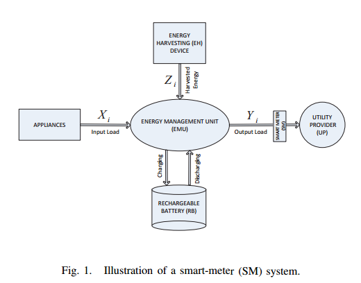

## [Smart Meter Privacy in the Presence of Energy Harvesting and Storage Devices](http://ieeexplore.ieee.org/stamp/stamp.jsp?arnumber=6486062)

### Summary

### Model

- X_i: the total amount of energy demand of the appliances at time i
- Y_i: the amount of energy the system request from utility provider
- Z_i: the amount of harvesting energy at time i
- b_i: the amount of energy in battery at time i

### Algorithm
- use *equivocation* to measure the uncertainty
- define information leakage rate, wasted energy rate
